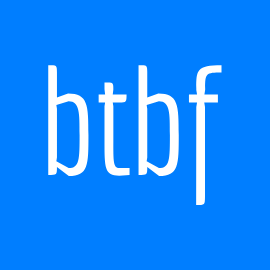

  

<h1 align="center">Back To Back Forever</h1>

    

    <strong>Fight Back To Back with your teammates</strong>
   
  A multiplayer first-person game in C+
   
   
  <a href="https://github.com/adaves1/BTBF/wiki">Documentation</a>
  ·
  <a href="https://github.com/adaves1/BTBF/issues">Report a Bug</a>
  ·
  <a href="https://github.com/adaves1/BTBF/issues">Request a Feature</a>

 

